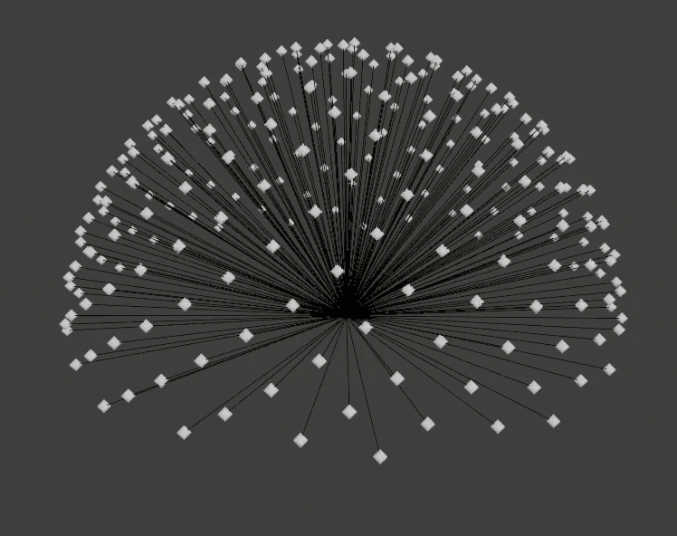
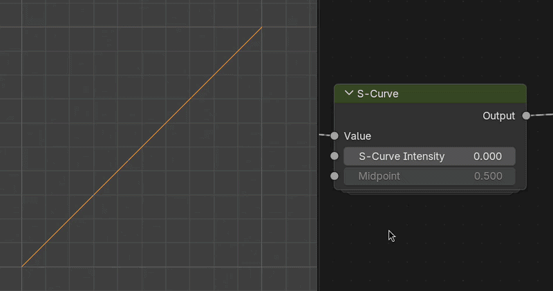
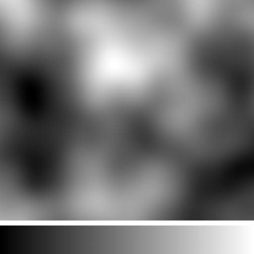
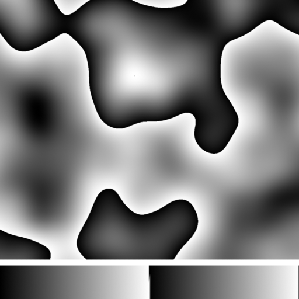
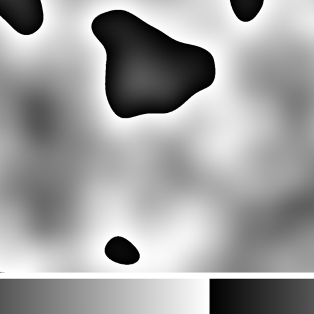
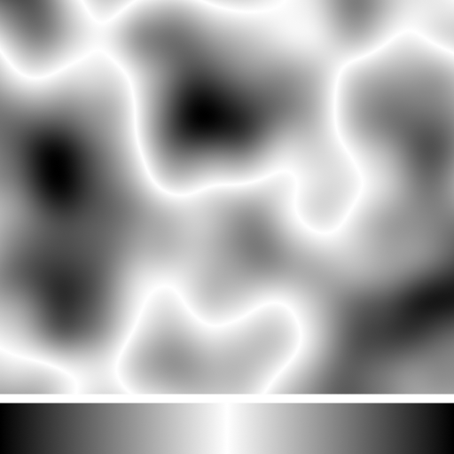
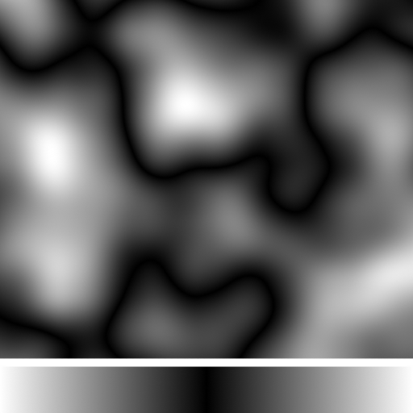
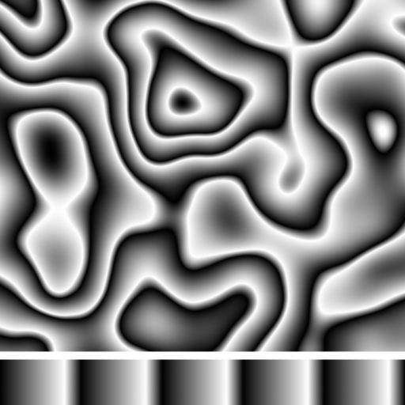

# Common Settings

## Raycasting

Modifiers that use ray casting use the same underlying method:

1. Rays are cast from a point in a Fibonacci cone up to the specified angle.

    { width=512 }

2. Collisions with geometry and their distance are recorded.
3. The collision data is averaged for the point using one of two methods:
    - **Hit count**: Collisions / Total rays
    - **Average Distance**: Hit Distance / (Total Rays * Ray Length)

## S-Curve

Many vertLab tools have "S-Curve" controls to quickly add contrast to 0:1 values.

There are two settings to control a S-curve:

- **Intensity/Amount** {-1:1} How much of a curve to add. 0 = linear interpolation.
- **Midpoint** {0:1} Where the center of the S is. At fully 0 or 1 the S-curve becomes a bias.

## Histogram Operations

These settings remap the 0:1 value range. You can see their effect on both a noise and linear gradient below.

- __Input Values__

    

    Base values, no operation.

- __Splits__

    

    Scales and loops the value range. Introduces harsh transitions.

- __Offset__

    

    Offsets and loops values.

- __Fold: Peaks__

    

    Values above a threshold will be inverted. The threshold becomes the new white point.

- __Fold: Valleys__

    

    Values below a threshold will be inverted. The threshold becomes the new black point.

- __Split + Fold__

    

    Folding values removes the harsh changes introduced with using "Split".
    

