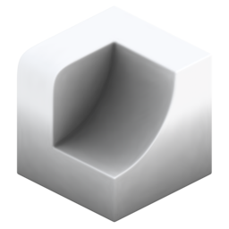

# Ambient Occlusion

{ width=128 }

## Outputs
- **Point Occlusion:** Output occlusion attribute for points (no sharp edges).
- **Face Corner Occlusion:** Output occlusion attribute for face corners (allows sharp edges). Domain must be set to "Face Corner".
- **Color:** Output occlusion as color attribute (used for visualisation).
## Settings

- **Strength:** Raises calculated AO by a power. Increase to darken AO.
- **Domain:** Calculate AO per:
    - **Point:** Calculate AO per point. Cheaper but does not allow for sharp edges.
    - **Face Corner:** Calculate AO on face corners. More expensive but allows for sharp edges. Useful for low poly models

----
#### Rays
- **Accumilation:** How ray values are accumilated:
    - **Average Hit Distance:** Uses the average ray hit distance compared with the ray length. Often produces smoother results but values will change with the ray length.
    - **Hit Count:** Uses ray hit/miss ratio. Can be noisier but values are independent of ray length.
- **Ray Count:** Number of rays cast from each point.
- **Ray Length:** Maximum distance to check for ray collisions.
- **Cone Angle:** Maximum ray angle from the normal. Rays will be distributed evenly in a cone up to this angle.

----
#### Blur
Blur result. Can help improve noise on dense meshes.

- **Blur Iterations:** How many iterations to blur the result.

----
#### Occlusion Geometry
- **Occlusion Object:** Additional object to act as occluder.
- **Occlusion Collection:** Additional collection of objects to act as occluders.

