# Attribute Noise

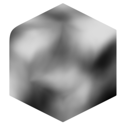{ width=128 }

Generate a greyscale noise attribute, optionally blending with an existing attribute. This modifier aims to give convenient access to useful noise types, warping, and value mapping options to provide a wide range of effects.

## Noise Types
Standard fBM and Voronoi noise types are available. Most base noise settings come directly from Blender's
[Noise texture node](https://docs.blender.org/manual/en/latest/modeling/geometry_nodes/texture/noise.html) and [Voronoi node](https://docs.blender.org/manual/en/latest/modeling/geometry_nodes/texture/voronoi.html)

For reference, here are examples of basic noises:

- __fBM__

    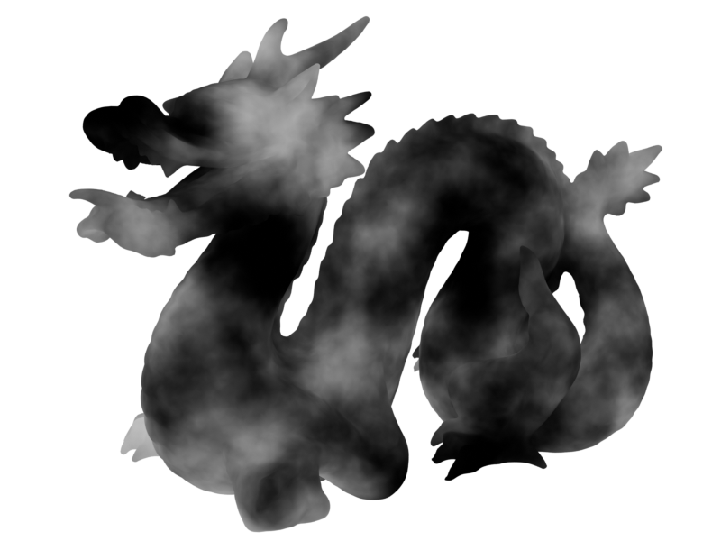

- __Voronoi Distance F1__

    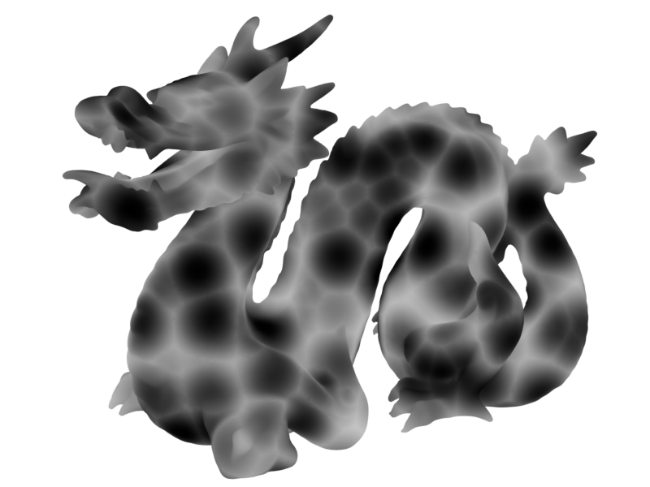

- __Voronoi Distance F2__

    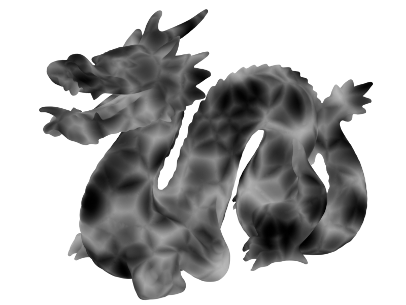

- __Voronoi Cells F1__

    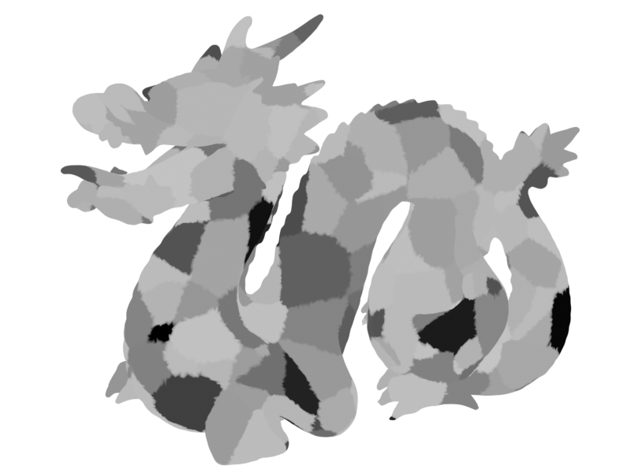

## Distortion

Distortion applies an offset to the position used to generate the noise, squashing and stretching the result. There are three categories of distortion:

### Scale

Distortion scale can be applied to squash and stretch noise along any of the 3 axes. Here we're stretching the noise by adjusting the Z scale.

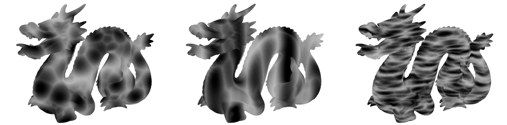

### Normal

Noise can be distorted with the normal, giving the effect of noise stretching along the surface. Pictured below is: No warping, normal warp with no smoothing, normal warp with smoothed normals.

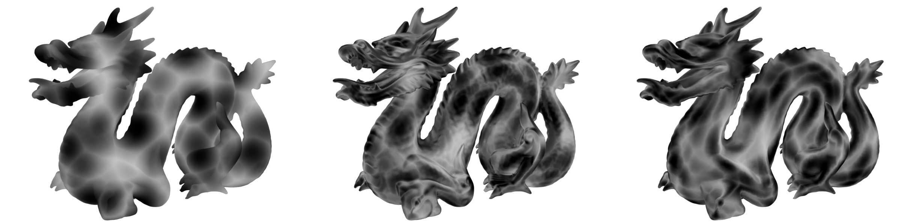

### Noise

You can warp noise using another noise. Pictured below is: No warping, detailed small warp, large scale warp:

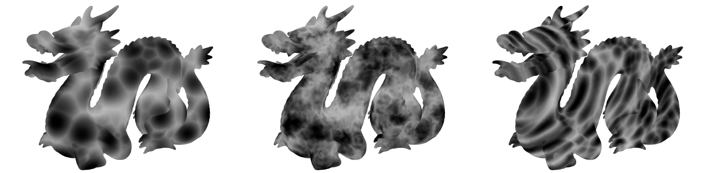

## Values

The values of the noise can be remapped in the values section.

[Histogram Operations](../common_settings.md#histogram-operations) can be used to add banding effects.

- __Base Noise__

    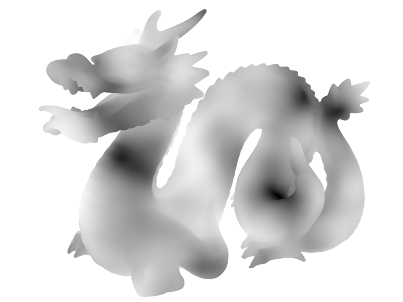

- __Histogram Banding__

    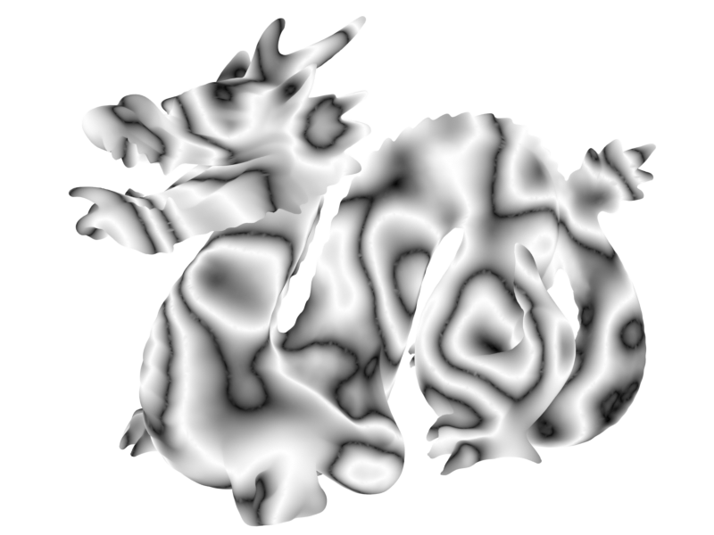

Gamma and [S-Curve Controls](../common_settings.md#s-curve) can add contrast.

- __Base Noise__

    

- __S-Curve Contrast__

    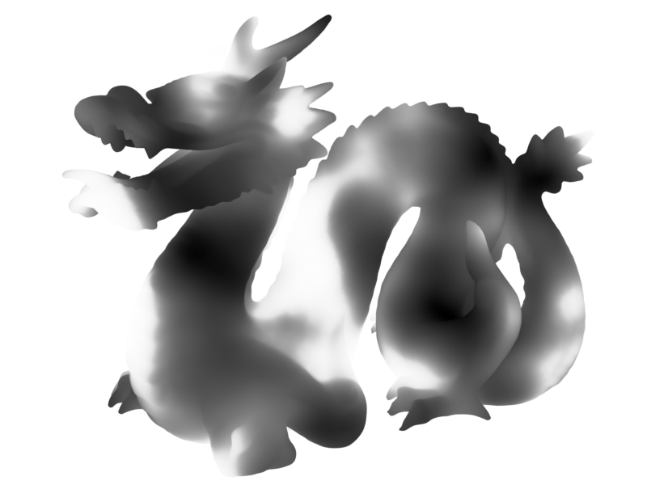

## Outputs
- **Noise:** Noise attribute.
- **Color:** Noise output as color (used for visualisation).
## Settings

- **Space:** Coordinate space used for noise:
    - **Local:** Use object's space.
    - **Global:** Use global space.
- **Noise Type:** Type of noise to generate:
    - **fBM.**
    - **Voronoi Distance.**
    - **Voronoi Cells.**
    - **Multifractal.**
    - **Hybrid Multifractal.**
    - **Ridged Multifractal.**
- **Voronoi Type:** Voronoi feature to compute:
    - **F1:** Distance to closest point.
    - **F2:** Distance to second closest point.
    - **Edge Distance:** Distance to edge of voronoi cell.
- **Distance:** Distance metric:
    - **Euclidian:** Euclidian distance (actual 3d distance).
    - **Manhattan:** Manhattan distance, separates distance components and adds them together.
    - **Chebychev:** Chebychev distance, separates distance components and chooses largest.
    - **Minkowski:** Minowski distance.

----
#### Noise Settings
Base settings for noise.

- **Feature Size:** Size of the largest features in the noise.
- **Offset:** Offset the noise W position. Effectively a smooth transition between seeds.
- **Detail:** The number of noise octaves. Higher values give more detailed noise but increase render time.
- **Roughness:** Blend factor between an octave and its previous one. A value of zero corresponds to zero detail.
- **Lacunarity:** The difference between the scale of each two consecutive octaves. Larger values corresponds to larger scale for higher octaves.
- **Octave Offset:** An added offset to each octave, determines the level where the highest octave will appear.
- **Gain:** An extra multiplier to tune the magnitude of octaves.
- **Exponent:** Exponent of the Minkowski distance.
- **Randomness:** Randomness of Voronoi points.

----
#### Distortion
Apply distortion to the noise.

- **Scale:** Scale applied to noise coordinates. Useful for directional noise such as wood grain or rock strata.

----
#### Normal Warp
Use mesh normal to warp noise.

- **Normal Warp:** Amount to use normals to warp the noise. Turning this to 1 will ignore position and use only normal.
- **Normal Blur:** Iterative blur for normals, use to smooth out the normal warping.

----
#### Noise Warp
Use another noise to warp coordinates.

- **Noise Warp:** Use another noise to warp coordinates.
- **Warp Amount:** Amount to warp the noise.
- **Feature Size:** Size of the largest features in the distortion noise.
- **Offset:** Offset the noise W position. Effectively a smooth transition between seeds.
- **Detail:** The number of noise octaves. Higher values give more detailed noise but increase render time.
- **Scale Effect:** How much non-uniform scale is applied to the warp noise.

----
#### Values
Remap the values of the noise.

- **Input Range:** Range of values from the generated noise.
    - **Auto:** Detect the minimum and maximum values on geometry and remap to use the full 0-1 range. Values can be unstable if you are changing the mesh or noise options.
    - **Stable:** Specify the min/max input. Values are stable against changes but will need tweaking for multifractal noises.
- **Value Range.**
- **Clamp Output:** Clamp output values between 0-1.

----
#### Histogram
Apply histogram operations.

- **Splits:** Create a saw-tooth banding effect. This value corresponds to the number of bands applied.
- **Fold:** Invert values above/below a threshold. Another method of creating a banding effect. Can be used to remove the abrupt changes in values caused by splits:
    - **None.**
    - **Peaks:** Invert values above a threshold.
    - **Valleys:** Invert values below a threshold.
- **Threshold.**

----
#### Contrast
Apply contrast operations.

- **Gamma:** Adjust gamma (power) of values.
- **S-Curve:** Intensity of S-curve applied to value. 0 = linear, 1 = maximum S-curve, -1 = maximum negative S-curve.
- **S-Curve Midpoint:** Shift the inflection point of the S-curve.
- **Interpolation:** Interpolation used for values:
    - **Linear:** Linear interpolation.
    - **Smooth Step:** Smooth Hermite edge interpolation (increases contrast).
    - **Smoother Step:** Smoother Hermite edge interpolation (further increases contrast).

----
#### Blend
Blend noise with another attribute.

- **Attribute:** Attribute to blend noise with.
- **Blend Mode:**
    - **Disable:** Disable blend.
    - **Replace:** Replace A with B.
    - **Multiply:** Muliply A by B.
    - **Add:** Add B to A.
    - **Min:** Minimum value of A and B.
    - **Max:** Maximum value of A and B.
    - **Screen:** Brighten A using the brightness of B.
    - **Overlay:** Brighten/darken A using values above/below 0.5 on B.
    - **Divide:** Divide A by B.
    - **Subtract:** Subract B from A.
- **Opacity:** Strength of the blend. Supply an attribute to act as a mask.

