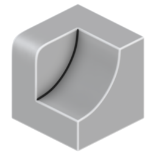

# Curvature

{ width=128 }

## Outputs
- **Curvature:** Curvature attribute.
- **Color:** Curvature attribute as color (used for visualisation).
## Settings

- **Method:** Method for measuring mesh curvature:
    - **Local Curvature:** Intrinsic curvature of the mesh. Fine details will effect the output dramatically
    - **Raycast Curvature:** Use raycast collisions to approximate larger scale curvature.
    - **SDF Curvature:** Generate a SDF from the mesh to read curvature from.
- **Strength:** Strength/contrast of the raycast result.
- **Calculate on Boundaries:** Cast rays from mesh boundaries. When on boundaries will often show convex curvature.

----
#### SDF
Settings for SDF generation.

- **Voxel Size:** Voxel size of the SDF, smaller values will create more detailed results but get exponentially more expensive. Hold [Shift] for more granular control.
- **Smooth SDF:** Number of iterations to smooth the SDF before reading curvature.

----
#### Rays
Raycast settings.

- **Ray Count:** Number of rays cast from each point. More rays increases quality but is more expensive. You can use a blur to smooth noise instead of raising the number of rays too high.
- **Ray Length:** Maximum distance to check for ray collisions. This will likely increase collisions and therefore scew the curvature towards concave (darker).

----
#### Occlusion Geometry
Additional collision geometry for curvature.

- **Occlusion Object:** Additional object that rays can collide with.
- **Occlusion Collection:** Additional collection of objects that rays can collide with.

----
#### Blur
Blur curvature to smooth results and decrease noise.

- **Blur Iterations:** Blur iterations to apply to curvature. Useful for removing noise.
- **Blur Weight:** Blur weight of each iteration. Useful at very low iteration counts to reduce the blur effect.

----
#### Debug
- **Debug View:** Changes the output of the modifier to visualise steps of the process. Make sure to disable after use.
    - **None:** Disable debug output
    - **SDF Mesh:** Output a mesh representation of the SDF used to generate curvature.

