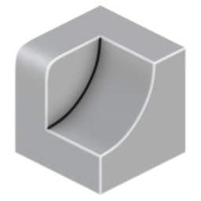
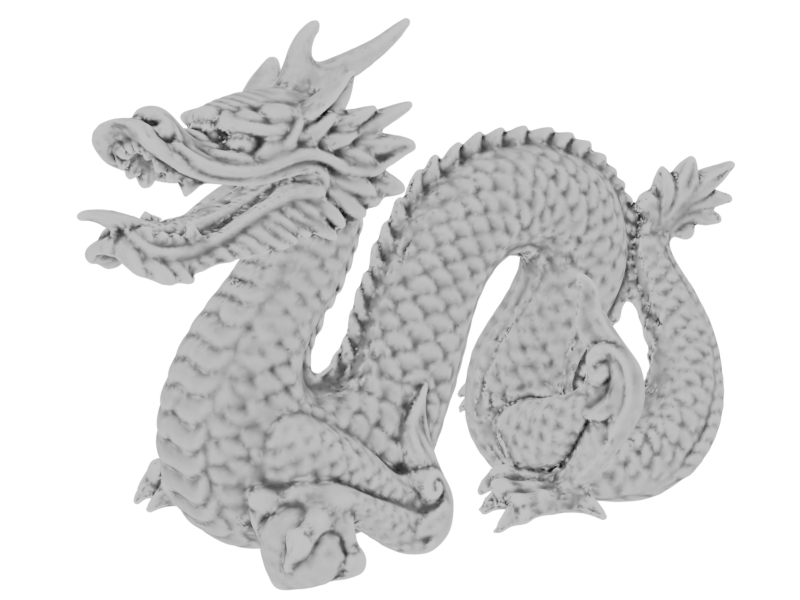
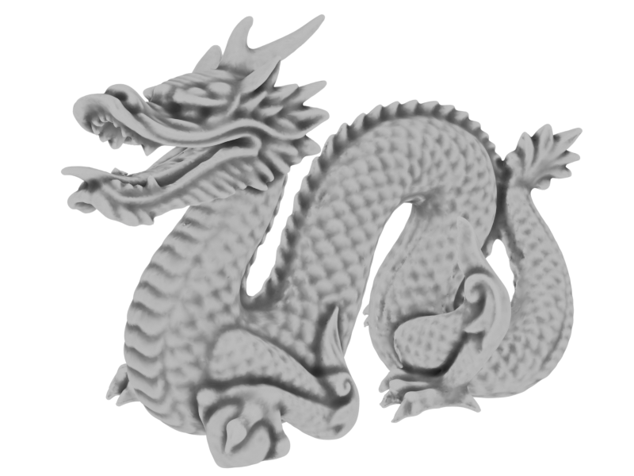

# Curvature

{ width=128 }

Calculate mesh curvature and store as attribute. There are five methods for calculating curvature:

- __Edge Angle__

    ---
    
    
    Average edge angle for each vertex. Cheap curvature approximation that is independent of scale. e.g. A lower poly version of the same mesh might have drastically different values.

- __Mean Curvature__

    ---

    
    Mean curvature of mesh at each point. Values are relative to a specified distance allowing for consistent curvature measurement across meshes.

- __Gaussian Curvature__

    ---

    
    Gaussian curvature of mesh at each point. A measure of surface shape: domes/bowls are lighter, saddles are darker. Values are relative to a specified distance.

- __Raycast Curvature__

    ---

    
    Cast rays in a sphere from each point to approximate larger scale curvature while retaining details. Higher ray lengths will darken concave areas more and start to resemble [ambient occlusion](./ambient_occlusion.md).

- __SDF Curvature__

    ---

    
    Generate a SDF from the mesh to read curvature from. Good for extracting larger-scale curvature from dense meshes.

!!! tip "Mesh detail"
    Fine mesh details can effect the output of curvature dramatically.
    
    The edge angle method is the most sensitive with Raycast and SDF curvature being less sensitive.

## Outputs
- **Curvature:** Curvature attribute.
- **Color:** Curvature attribute as color (used for visualisation).
## Settings

- **Method:** Method for measuring mesh curvature:
    - **Edge Angle:** Average edge angle for each vertex. Cheap curvature with no scale.
    - **Mean Curvature:** Mean curvature of mesh. Values are relative to a specified distance.
    - **Gaussian Curvature:** Gaussian curvature of mesh. A measure of surface shape: domes/bowls are lighter, saddles are darker. Values are relative to a specified distance.
    - **Raycast Curvature:** Use raycast collisions in a sphere to approximate larger scale curvature. Higher ray lengths will darken concave areas.
    - **SDF Curvature:** Generate a SDF from the mesh to read curvature from.
- **Space:**
    - **Local:** Use object coordinates.
    - **Global:** Use world coordinates.
- **Scale:** Distance that curvature is measured against. Sets the black/white points of the output.
- **Max Angle:** Maximum edge angle. Sets the black/white points of the output.

----
#### SDF
Settings for SDF generation.

- **Voxel Size:** Voxel size of the SDF, smaller values will create more detailed results but get exponentially more expensive. Hold [Shift] for more granular control.
- **Smooth SDF:** Number of iterations to smooth the SDF before reading curvature.

----
#### Rays
Raycast settings.

- **Calculate on Boundaries:** Cast rays from mesh boundaries. When on boundaries will often show convex curvature.
- **Ray Count:** Number of rays cast from each point. More rays increases quality but is more expensive. You can use a blur to smooth noise instead of raising the number of rays too high.
- **Ray Length:** Maximum distance to check for ray collisions. This will likely increase collisions and therefore scew the curvature towards concave (darker).

----
#### Occlusion Geometry
Additional collision geometry for curvature.

- **Occlusion Object:** Additional object that rays can collide with.
- **Occlusion Collection:** Additional collection of objects that rays can collide with.

----
#### Blur
Blur curvature to smooth results and decrease noise.

- **Blur Iterations:** Blur iterations to apply to curvature. Useful for removing noise.
- **Blur Weight:** Blur weight of each iteration. Useful at very low iteration counts to reduce the blur effect.

----
#### Values
- **Range:** Output range of curvature values:
    - **0-1:** Curvature values are mapped between 0-1. Recommended for most situations.
    - **Free:** Specify output range of values.
- **Output:** Type of curvature to output:
    - **Full Curvature:** Map full curvature to 0-1 range. 0.5 = No curvature, >0.5 = Convex, <0.5 = Concave.
    - **Convexity:** Map convexity to 0-1 range. 0 = Flat or concave, 1 = Maximum convexity.
    - **Concavity:** Map concavity to 0-1 range. 0 = Flat or convex, 1 = Maximum concavity.
    - **Absolute Curvature:** Ignore concavity/convexity. Map any curvature to 0-1 range.
- **Clamp:** Clamp values between the specified min / max.
- **Min / Max:** Specify the output range of values. If "Clamp" is off values may exceed this range.
- **Contrast:** Add S-curve contrast to values.
- **Contrast Midtone:** Change the midpoint of the contrast S-curve.

----
#### Debug
- **Debug View:** Changes the output of the modifier to visualise steps of the process. Make sure to disable after use.
    - **None:** Disable debug output.
    - **SDF Mesh:** Output a mesh representation of the SDF used to generate curvature.
