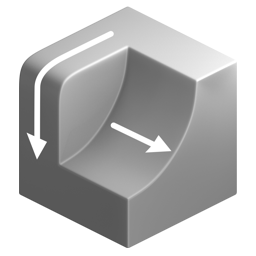
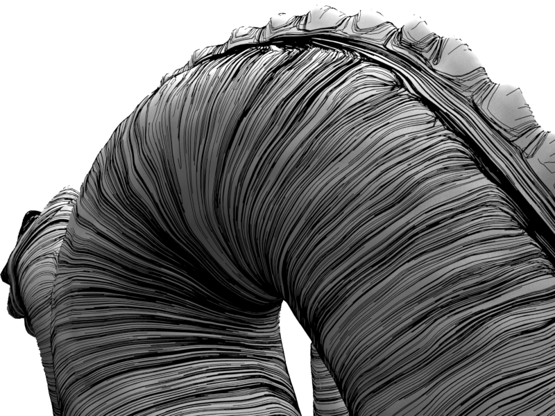
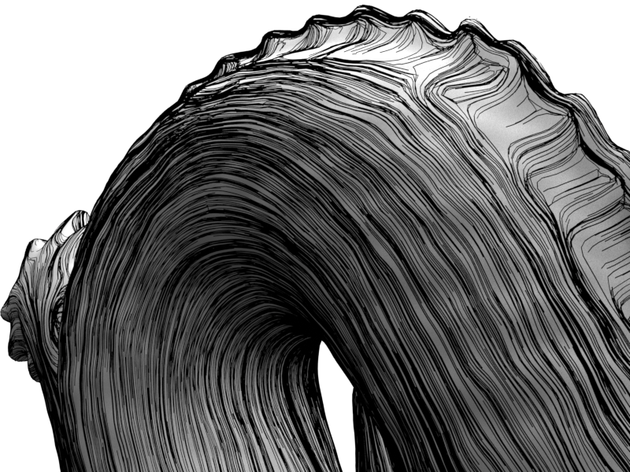
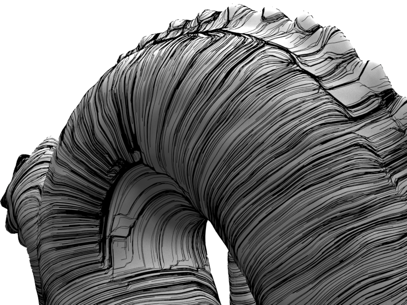
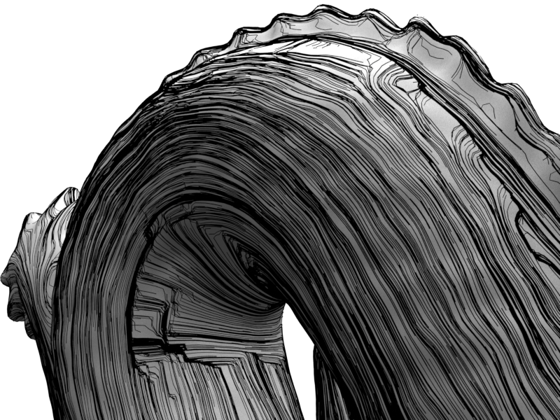
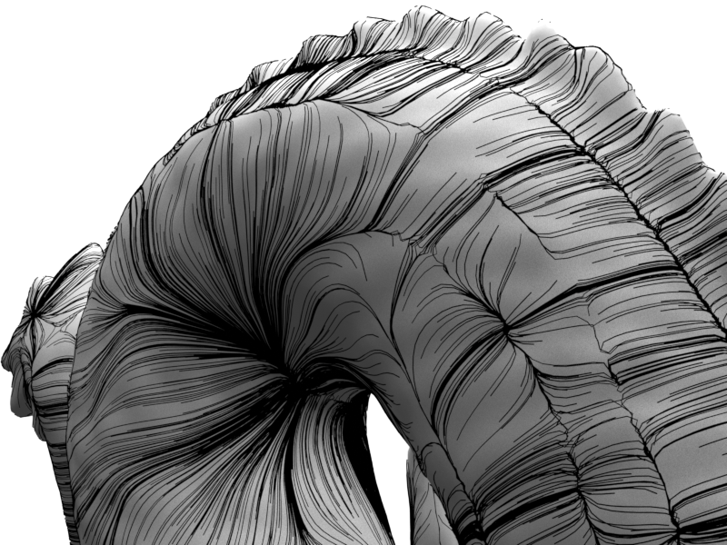
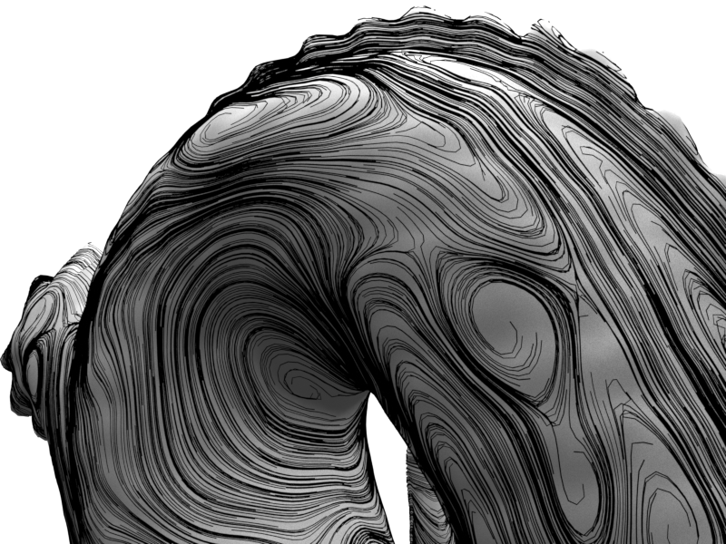
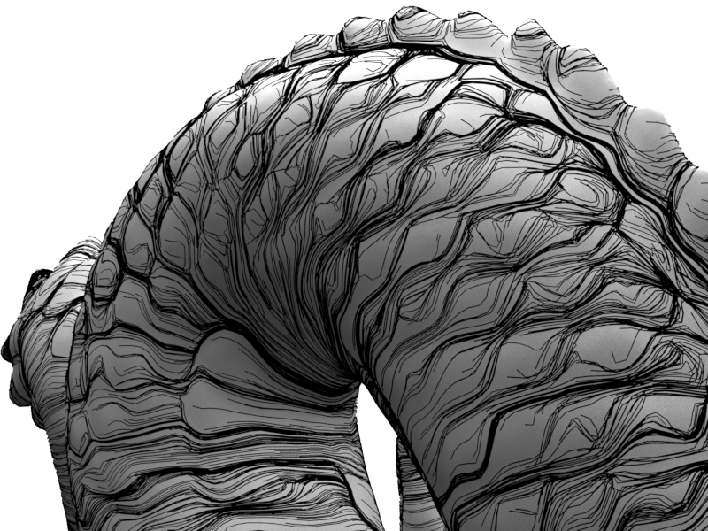

# Curvature Direction

{ width=128 }

Calculate the direction of maximum and minimum mesh curvature. The result is a vector that can be used for further operations such as [Attribute Flow](../modify_attributes/attribute_flow.md) or point advection.

!!! info "Images on this page use a simple point advection available in the examples file."
    
## Types of Curvature Direction

### Principled Curvature - Signed

Direction of maximum signed curvature: Across convex areas, along concave areas. Vectors can flip as the property is bi-directional.

- __Max Curvature__
    
    

- __Min Curvature__

    

### Principle Curvature - Unsigned

Direction of maximum unsigned curvature: Across both convex and concave areas. Prone to abrupt right angle changes. Vectors can flip as the property is bi-directional.

- __Max Curvature__
    
    

- __Min Curvature__

    

### Change in Normals

Direction of change in neighboring normals. Produces a more swirly field that has a single direction (doesn't suffer from flipping).

- __Max Curvature__
    
    

- __Min Curvature__

    

## Smoothing the Direction

The option to smooth input normals can be used to filter the scale of curvature to measure.

- __Unsmoothed Input Normals__
    
    

- __Smoothed Input Normals__
    
    

## Outputs
- **Curvature Max Dir:** Direction of maximum curvature.
- **Curvature Min Dir:** Direction of minimum curvature.
- **Color:** Direction of min/max curvature depending on debug settings.
## Settings

- **Curvature:** Type of curvature direction:
    - **Principle Signed:** Direction of maximum signed curvature: Across convex areas, along concave areas. Vectors can flip as the property is bi-directional.
    - **Principle Unsigned:** Direction of maximum unsigned curvature: Across both convex and concave areas. Prone to right angle changes. Vectors can flip as the property is bi-directional.
    - **Change in Normals:** Direction of change in neighboring normals. Produces a more swirly field that is immune from the bidirectional flipping issue.
- **Use Triangulated Mesh:** Use a triangulated copy of the mesh to calculate curvature.
- **Smooth Normals:** Iterations to smooth normals before calculating curvature direction.

----
#### Debug Views
- **Debug Direction:**
    - **Max:** View maximum curvature direction.
    - **Min:** View minimum curvature direction.
- **Draw Debug Vectors.**
- **Length:** Length of displayed vectors.
- **Color:** Output color attributes. Toggles outputting existing "Color" attribute or curvature direction. Remove output attribute to stop writing a color attribute.
- **Color Values:**
    - **Remapped 0-1:** Remap values to 0-1 to view the full range as color. Areas of direction reversal visible.
    - **Unchanged:** Use curvature values directly as color. Areas of direction reversal visible.
    - **Absolute:** Absolute curvature direction. Ignores areas of direction reversal.
