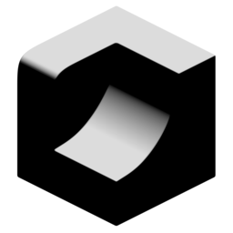

# Direction Angle

{ width=128 }

## Outputs
- **Point Output:** Output as point attribute, this will ignore sharp edges.
- **Face Corner Output:** Output as face corner attribute. This will respect sharp edges.
- **Color:** Output as face corner color (used for visualisation).
## Settings

- **Space:** Coordinate space of direction vector:
    - **Local.**
    - **Global.**
- **Direction:** Direction to measure angle against.
- **Both Directions:** Also measure the reverse direction and choose the maximum value.
- **Angle Type:** How the angle to the direction is measured:
    - **Threshold:** Simple binary cutoff based on an angle threshold.
    - **Range:** Fade values between a minimum and maximum angle value
- **Threshold:** Angle threshold for normals. Normals that are within this range of the direction will be white, others will be black.
- **Min Angle:** Normals within this angle of the direction will be white.
- **Max Angle:** Normals between the min and max angle will interpolate smoothly transition from white to black.
- **Invert Value:** Invert the attribute.

