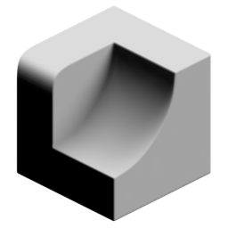

# Directional Occlusion

{ width=128 }

## Outputs
- **Point Occlusion:** Output occlusion attribute for points (no sharp edges).
- **Face Corner Occlusion:** Output occlusion attribute for face corners (allows sharp edges). Domain must be set to "Face Corner".
- **Color:** No description provided.
## Settings

- **Domain:** Calculate occlusion per:
    - **Point:** Calculate occlusion per point. Cheaper but does not allow for sharp edges.
    - **Face Corner:** Calculate occlusion on face corners. More expensive but allows for sharp edges. Useful for low poly models
- **Space:** Coordinate space of direction vector:
    - **Local:** Use object space direction
    - **Global:** Use world space direction

----
#### Rays
- **Accumilation:** How ray values are accumilated:
    - **Average Hit Distance:** Uses the average ray hit distance compared with the ray length. Often produces smoother results but values will change with the ray length.
    - **Hit Count:** Uses ray hit/miss ratio. Can be noisier but values are independent of ray length.
- **Direction:** Direction to cast rays.
- **Ray Count:** Number of rays cast from each point/corner.
- **Ray Length:** Maximum distance to check for ray collisions.
- **ConeAngle:** Rays will be distributed evenly in a cone up to this angle. Higher angles will have softer occlusion.

----
#### Blur
Blur result. Can help improve noise on dense meshes.

- **Blur Iterations:** How many iterations to blur the result.

----
#### Occlusion Geometry
Additional geometry to occlude rays.

- **Object:** Additional object to act as occluder.
- **Collection:** Additional collection of objects to act as occluders.

