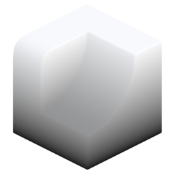

# Linear Gradient

{ width=128 }

## Outputs
- **Gradient:** Output point attribute.
- **Color:** Output attribute as color (used for visualisation).
## Settings

- **Space:** Coordinate space of gradient direction:
    - **Local.**
    - **World.**
- **Axis:** Axis to generate gradient on:
    - **X.**
    - **Y.**
    - **Z.**
- **Invert:** Invert/reverse the gradient.
