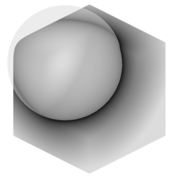

# Object Distance

{ width=128 }

## Outputs
- **Output:** Distance point attribute.
- **Color:** Distance attribute as color (used for visualisation).
## Settings

----
#### Objects
- **Objects/Collection:** Choose up to 6 objects or a collection:
    - **Objects.**
    - **Collection.**
- **Object Count:** Number of objects to include.
- **Union Manifold Islands:** Union manifold mesh islands. This removes areas of mesh overlap.

----
#### Distance
- **Distance:** How to measure distance from surface.
    - **Unsigned:** Absolute distance from the surface.
    - **Signed:** Areas inside the surface have negative distance, outside areas have positive distance.
- **Min Distance:** Points closer than this will be black.
- **Max Distance:** Points further away than this will be white.
- **Interpolation:** Interpolation of distance to value.
    - **Linear.**
    - **Smooth Step.**
    - **Smoother Step.**
- **Invert:** Invert the values of the distance attribute.

----
#### Blur
Blur the distance attribute.

- **Iterations:** How many times to blur the values for all elements.

