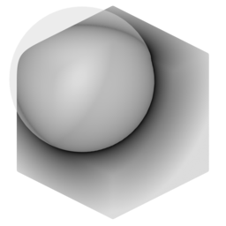
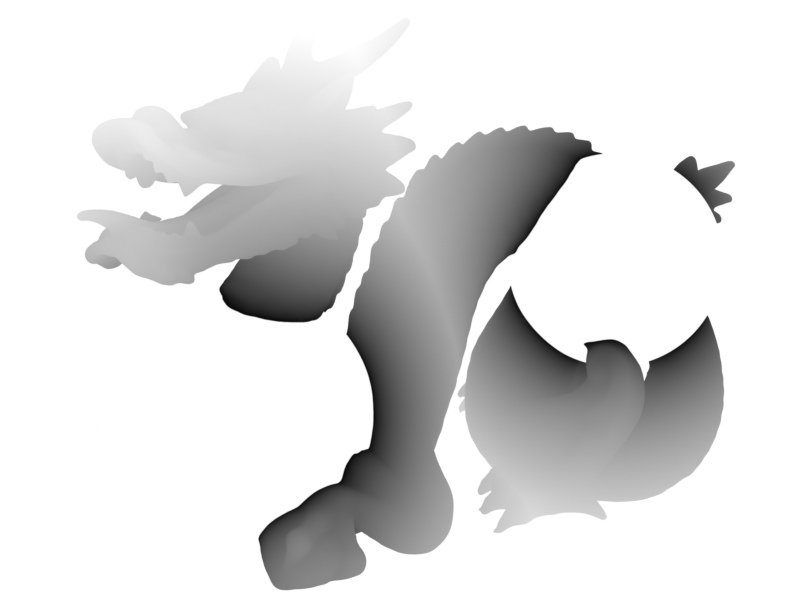
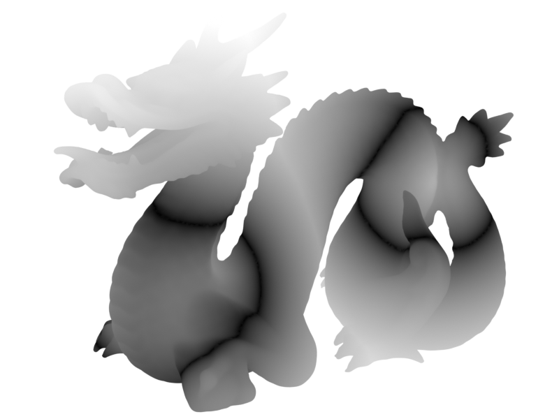
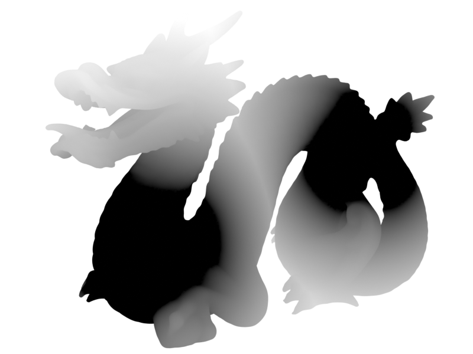
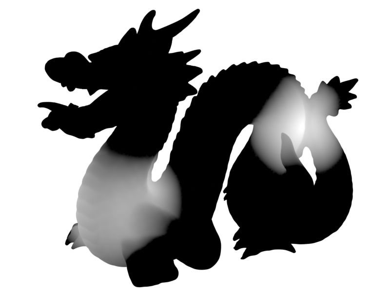
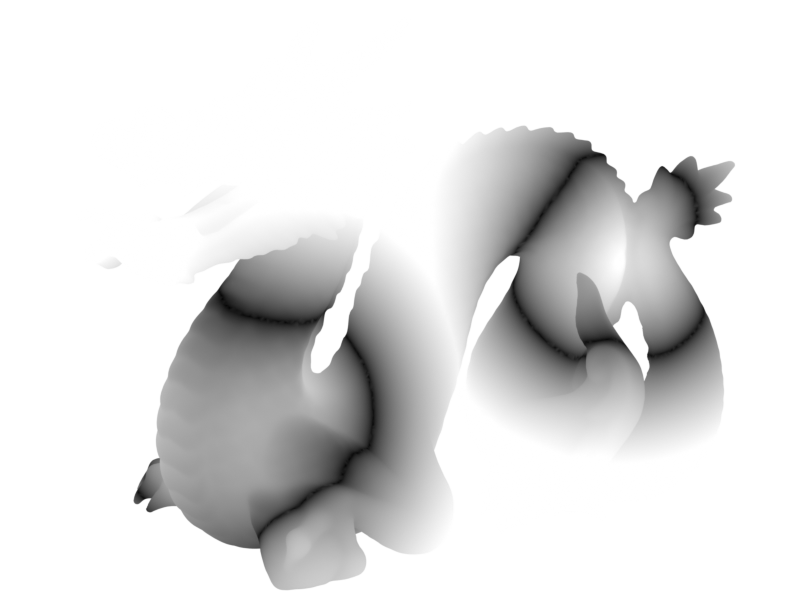
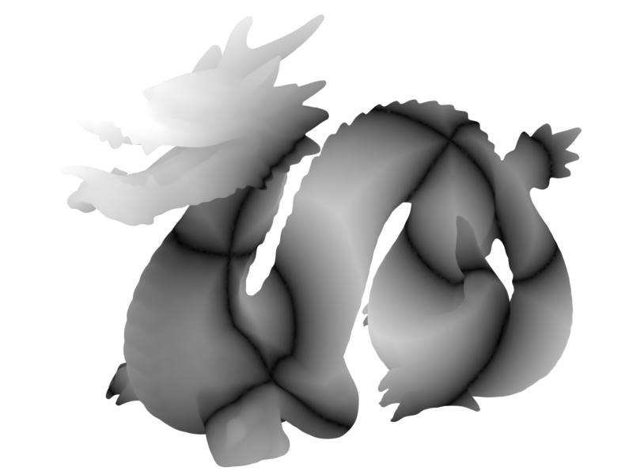
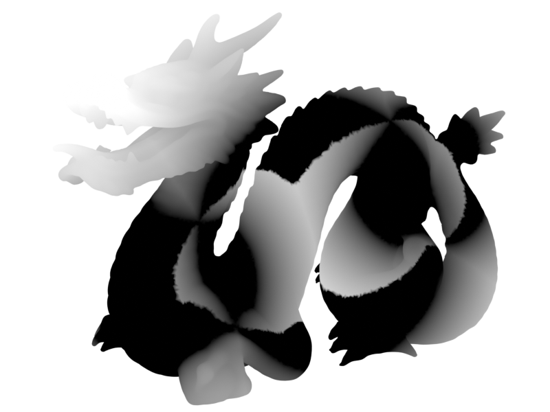
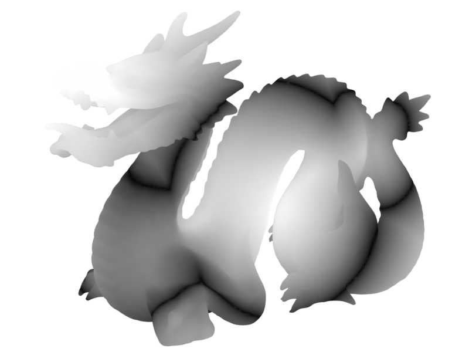
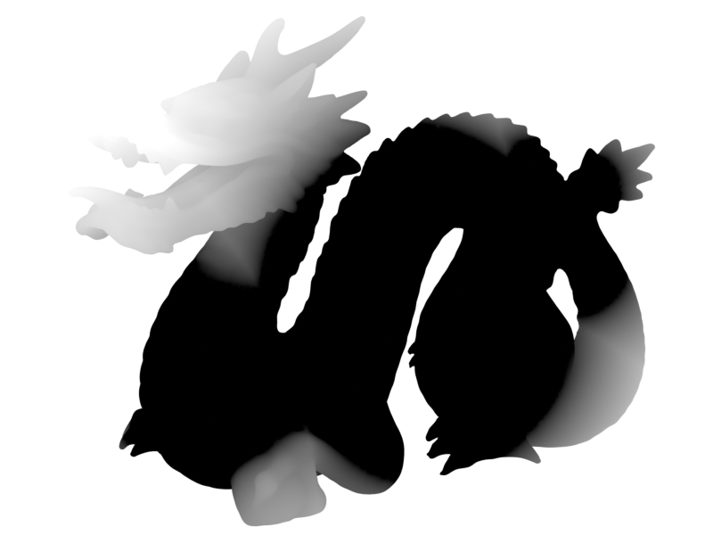

# Object Distance

{ width=128 }

Calculate distance from the surface of other meshes.

Specify up to 6 objects or a collection to measure distance from.

## Signed/Unsigned Distance

- Unsigned distance is the absolute distance to nearest surface.
- Signed distance will produce negative distances on the inside of objects. 

- __Unsigned Distance__

    

- __Signed Distance__

    

Signed distance will allow isloation of outside/inside areas when remapping.

- __Signed Distance Remap__

    

- __Unsigned Distance Remap__

    

## Union Islands

There is an option to union Boolean manifold islands before calulating distance. This removes artifacts caused by overlapping surfaces.

- __Union Off__

    Unsigned

    

    Signed

    

- __Union On__

    Unsigned

    

    Signed

    

## Outputs
- **Output:** Distance point attribute.
- **Color:** Distance attribute as color (used for visualisation).
## Settings

----
#### Objects
- **Objects/Collection:** Choose up to 6 objects or a collection:
    - **Objects.**
    - **Collection.**
- **Object Count:** Number of objects to include.
- **Union Manifold Islands:** Union manifold mesh islands. This removes areas of mesh overlap.

----
#### Distance
- **Distance:** How to measure distance from surface.
    - **Unsigned:** Absolute distance from the surface.
    - **Signed:** Areas inside the surface have negative distance, outside areas have positive distance.
- **Min Distance:** Points closer than this will be black.
- **Max Distance:** Points further away than this will be white.
- **Interpolation:** Interpolation of distance to value.
    - **Linear.**
    - **Smooth Step.**
    - **Smoother Step.**
- **Invert:** Invert the values of the distance attribute.

----
#### Blur
Blur the distance attribute.

- **Iterations:** How many times to blur the values for all elements.

