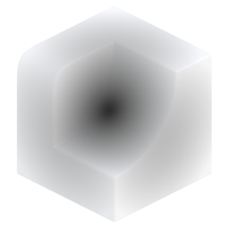

# Radial Gradient

{ width=128 }

## Outputs
- **Gradient:** Output gradient.
- **Color:** Output gradient as color (used for visualisation).
## Settings

----
#### Gradient Center
- **Space:** Coordinate space of center:
    - **Local.**
    - **World.**
- **Center:** Center of the gradient:
    - **Bounding Box:** Use the center of the bounding box
    - **Origin:** Object or world origin, depending on coordinate space
- **Offset:** Offset center of gradient.

----
#### Values
- **Value Range:**
    - **Automatic (Full):** Expand values to use the full 0-1 range. Updating the mesh can change existing values
    - **Specific:** Specify distances for black/white. Stable against mesh changes
- **Min Distance:** Black point distance from center.
- **Max Distance:** White point distance from center.
- **Invert:** Invert gradient values.

