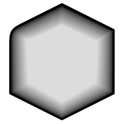

# Silhouette Distance

{ width=128 }

## Outputs
- **Silhouette Distance:** Output attribute.
- **Color:** Output attribute as color (used for visualisation).
## Settings

----
#### Camera
- **Camera:** Which camera to use for silhouette projection:
    - **Active:** Use the scene's active camera
    - **Specific:** Specify a camera object
- **Object:** Camera Object.

----
#### Distance
- **Relative To:** Scale silhouette distance with:
    - **Object:** Silhouette distance scales with object. Objects further away will have thinner silhouettes
    - **Camera Distance:** Silhouettes remain roughly the same size regardless of camera distance.
    - **Camera Distance & FOV:** Silhouette distance scales with camera distance and FOV. Provides the most consistent silhouette in camera's view.
- **Silhouette Resolution:** Grid resolution of silhouette projection.
- **Edge Thickness:** Expand a black edge around the object.
- **Fade Distance:** Distance from edge to fade to white.
- **Blur Iterations:** Blur the result by a number of iterations.
- **Invert:** Invert the values of silhouette.
