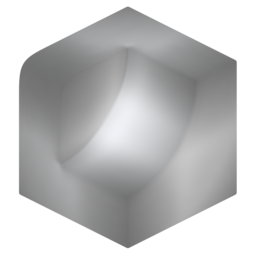

# Thickness

{ width=128 }

## Outputs
- **Thickness:** Output thickness attribute.
- **Color:** Output thickness attribute as color (used for visualisation).
## Settings

----
#### Rays
- **Accumilation:** How ray values are accumilated:
    - **Average Hit Distance:** Uses the average ray hit distance compared with the ray length. Often produces smoother results but values will change with the ray length.
    - **Hit Count:** Uses ray hit/miss ratio. Can be noisier but values are independent of ray length.
- **Ray Count:** Number of rays cast from each point.
- **Ray Length:** Maximum distance to check for ray collisions.
- **ConeAngle:** Maximum ray angle from the normal. Rays will be distributed evenly in a cone up to this angle.

----
#### Blur
Blur result. Improves noisy results.

- **Blur Iterations:** How many iterations to blur the result.

----
#### Occlusion Geometry
Additional geometry for rays to collide with.

- **Occlusion Object:** Additional object to act as occluder.
- **Occlusion Collection:** Additional collection of objects to act as occluders.

