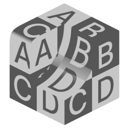

# Tri-Planar Texture

{ width=128}

Projects a greyscale image texture onto a mesh along three axes.

## Outputs
- **Texture:** No description provided.
- **Color:** No description provided.
## Settings

- **Texture:** Texture to project along three axes.
- **Blend:** Blend between projection planes using the normal.
- **Tile Size:** Size of the texture.

----
#### Projection Orientation
Offset and rotate the projection.

- **Rotation:** Rotate the projection.
- **Offset:** Offset the projection.

