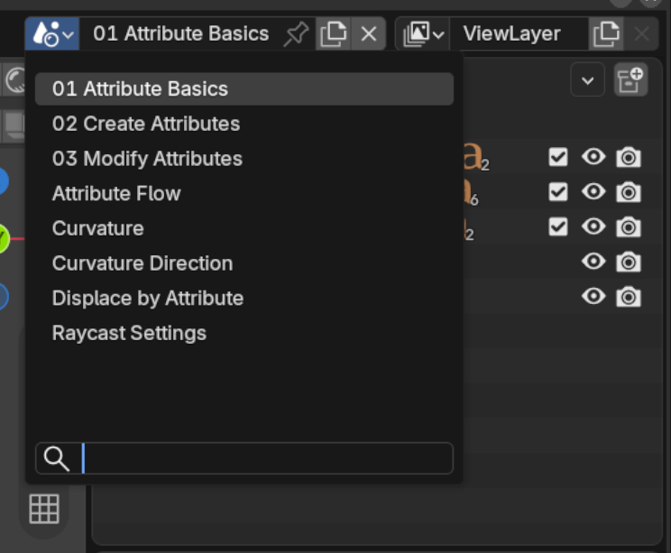
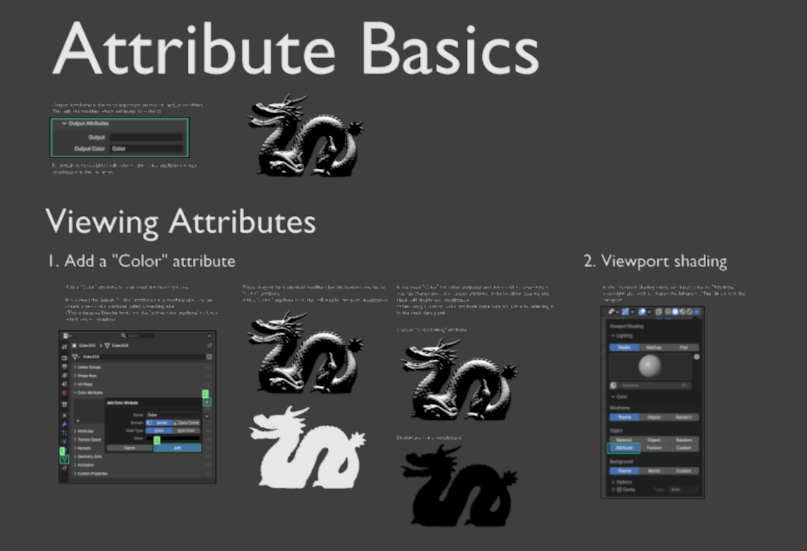
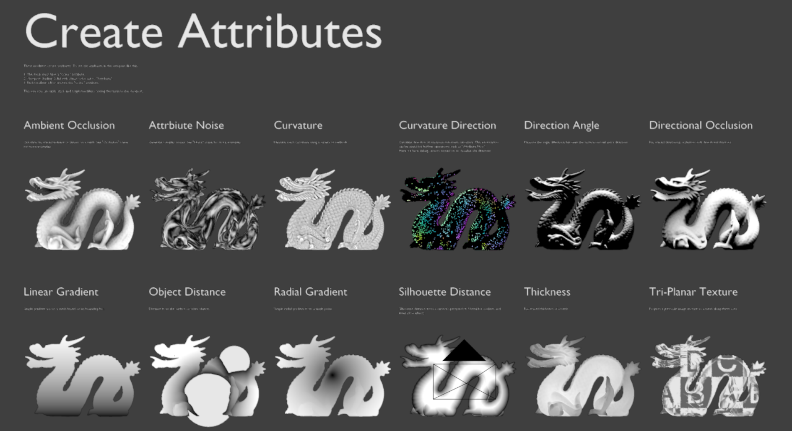
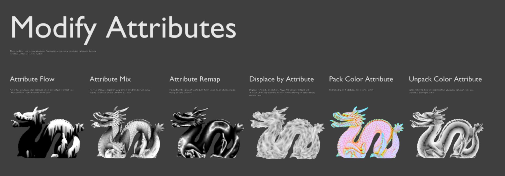
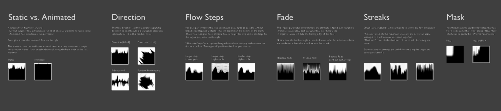
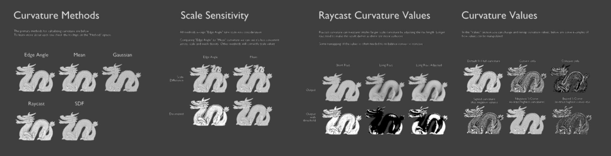
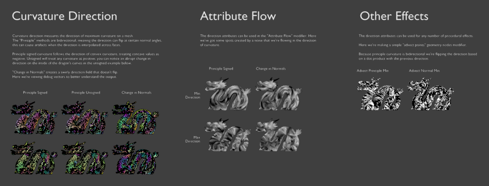
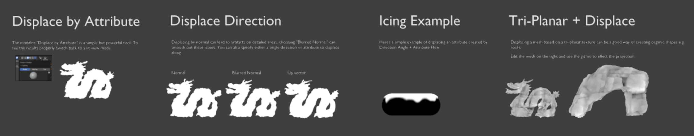
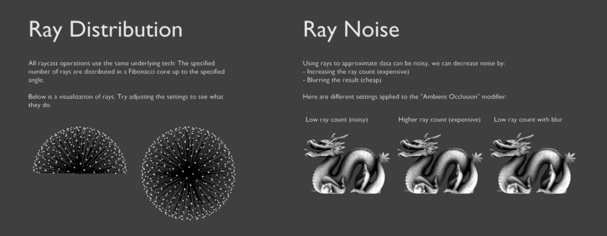

# Examples File

## Example Scenes
Examples for all tools can be found in the "Examples" file, available as a separate download on the store page: ***vertLab \[version\] Examples.blend***

This file contains several scenes showing different categories of modifiers. Navigate to different scenes using the scene selector.

{width=512}

## Attribute Basics
{width=512}

## Create Attributes
{width=600}

## Modify Attributes
{width=600}

## Attribute Flow
{width=600}

## Curvature
{width=600}

## Curvature Direction
{width=600}

## Displace by Attribute
{width=600}

## Raycast Settings
{width=600}