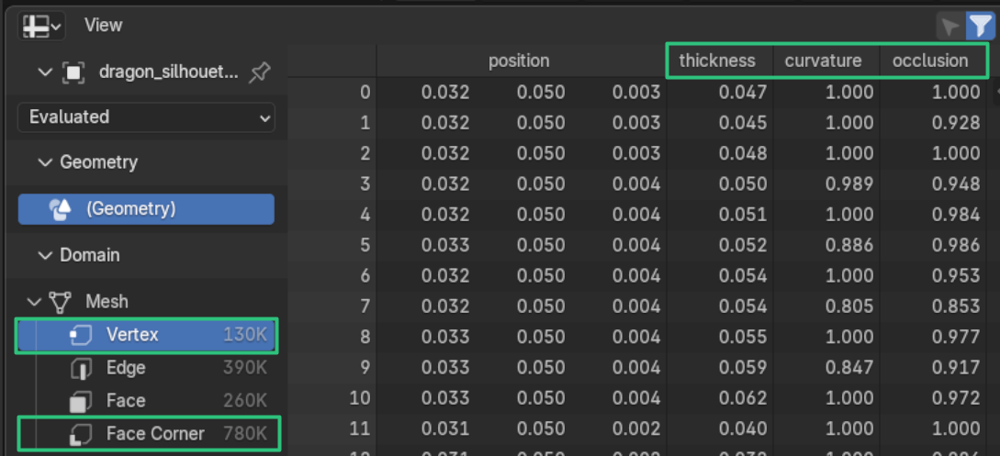

# 2. Working with Attributes

vertLab works mostly with float attributes. You can think of this as a greyscale vertex color, usually between [0:1].

!!! info "vertLab is Geometry Based"
    The resolution of vertLab is directly influenced by mesh density/topology.

A float attribute is identical/interchangable with Blender's [Vertex Groups](https://docs.blender.org/manual/en/latest/modeling/meshes/properties/vertex_groups/assigning_vertex_group.html). You can also paint them in [Weight Paint](https://docs.blender.org/manual/en/latest/grease_pencil/modes/weight_paint/introduction.html#weight-paint) mode.

## Output Attributes

!!! tip "Output Attributes"
    **Output Attributes** is the most important section of vertLab modifiers. This tells the modifier which attributes to write to.

    { width=512 }
    
    By default most modifiers will write to the *Color* attribute for easy visualisation in the viewport. **This doesn't mean they've also written to an attribute.**
    
    Some modifiers have a default attribute they write to, but not all.

You can write to existing attributes or create new ones by typing a new name.

## Viewing attributes in the viewport

By default vertLab modifiers overwrite the *Color* attribute so their effect can be easily seen in the viewport.\* To show *Color* in the viewport:

- __1. Add Color Attribute__

    ---

    Add a *Color* attribute to your mesh if it hasn't got one.

    

    (This is because Blender looks for the "active color attribute" to know which one to visualize).

- __2. Change Viewport Shading__

    ---

    In the Viewport Shading menu set object color to "Attribute".

    

## Keeping track of attributes

You can see all the attributes an object has by looking at the geometry spreadsheet ***Vertex*** and ***Face Corner*** tabs:

### Points vs Face Corners
vertLab attributes are usually stored as point attributes but some allow for storing on face corners.

- **Point:** Lower memory, usually cheaper to calculate, can't have sharp edges.
- **Face Corner:** Higher memory, usually more expensive to calculate. allows for sharp edges.
