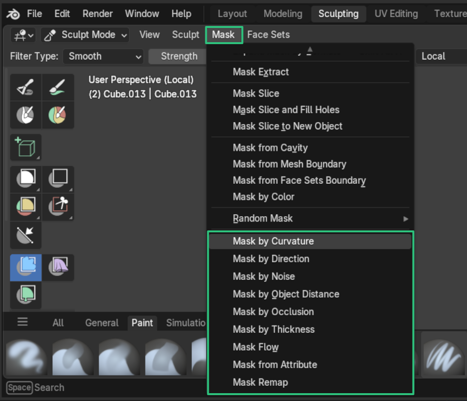

# 3. Working with Sculpting Masks

Sculpting mask tools are available through the ***Mask*** menu in sculpt mode.

{width=512}

Each mask tool has similar settings to its modifier counterpart with extra options for how to blend with the current mask.