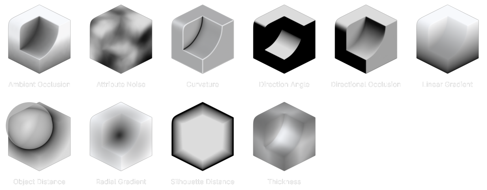
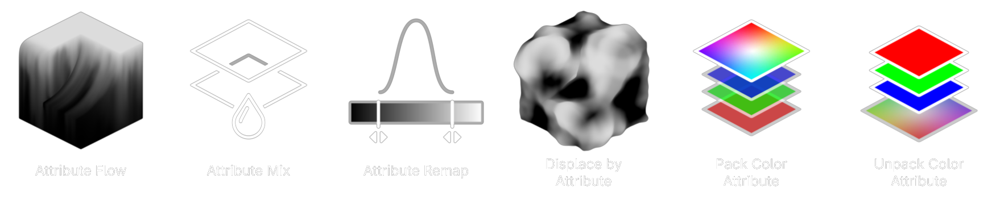
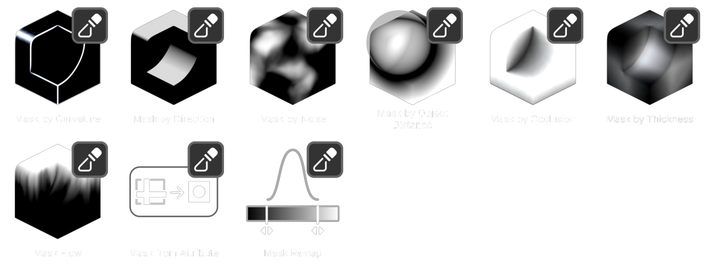

# :construction: vertLab

!!! warning
    This site is currently placeholder/WIP

Welcome to the vertLab documentation. Here you'll find everything there is to know about the tools.

## What is vertLab?

vertLab is a collection of tools for controlling **vertex attributes** and **sculpting masks**.

Attributes are incredibly versatile, example uses include:

- Use in shaders e.g. for texture blending.
- Use to drive displacement.
- Bake to textures or use as masks in the texturing process.
- Pack to vertex colors and exported to game engines.

!!! info "vertLab is Geometry Based"
    The resolution of vertLab is directly influenced by mesh density/topology.
    

### :material-plus-network: Create Attributes

Create attributes from advanced mesh analysis tools such as ray-traced occlusion and curvature. Other generators include noise, gradients and camera-based silhouette.

### :octicons-sliders-24: Modify Attributes

Modify attributes by remapping, mixing or flowing them down a mesh. You can also pack up to four attributes to a vertex color for exporting to game engines.

### :material-brush: Sculpting Masks

Use vertLab's powerful attribute tools directly on sculpting masks. This includes mask creation, manipulation and blending.

### Vertex Attributes

Create, modify, mix and pack vertex attributes using modifiers.

Create attributes:

- Ambient Occlusion
- Curvature
- Thickness
- Directional Occlusion
- Direction Angle
- Linear/Radial Gradient
- Silhouette Distance
- Noise

Modify Attributes:

- Attribute Flow
- Attribute Remap

- Attribute Mix
- Pack Color Attribute

### Sculpting Masks

asdf

## Tool Highlights

### Advanced Mesh Analysis

### Attribute/Mask Flow

### Vertex Color powerhouse