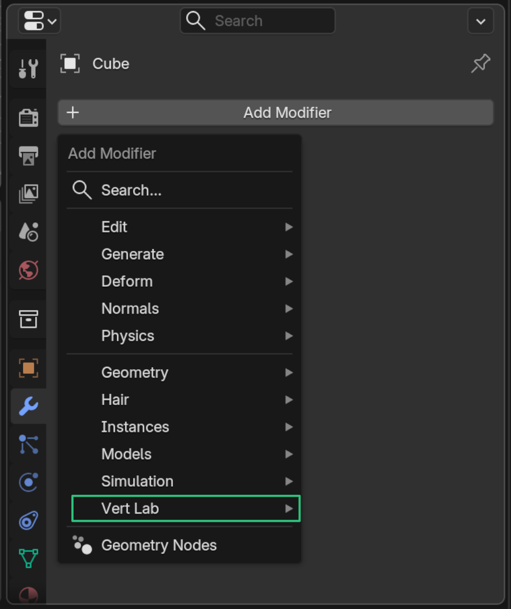

# Install

vertLab is installed as an **asset library**, not an add-on.

!!! tip "TLDR"
    Download the **.zip**, extract to a folder, add the folder as an asset library.
    
    For more detailed instructions see below.

    !!! info "For more information on asset libraries you can check Blender's [Official Documentation](https://docs.blender.org/manual/en/latest/files/asset_libraries/introduction.html#introduction)"

### First Time Install

1. Download latest .zip file for the closest Blender version (*vertLab 5.2 v1.0.0.zip*).
2. Unzip/extract to a folder in your desired location.
3. Open Blender and go to **Edit/Preferences/Asset Libraries.**
4. Click ++"\+"++ Add Asset Library.
5. Navigate to the unzipped folder and press **Add Asset Library**.
6. You should now see "Vert Lab" in your asset libraries.  
**Recommended**: Here you can choose how the data is imported by default. Setting this to **Pack** or **Link** will make it easier to update versions. **Pack** is recommended, see [Official Documentation](https://docs.blender.org/manual/en/latest/editors/asset_browser.html#import-settings) for more information.

vertLab should now be installed. Modifiers will now show up under the **Add Modifier** menu.

{width=512}