# Attribute Flow

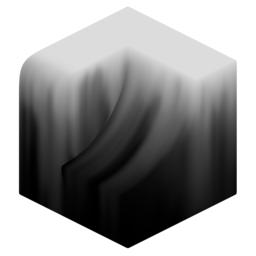{ width=128 } 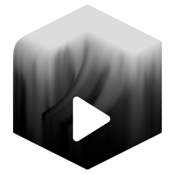{width=128}

Run a flow simulation of an attribute across the surface of a mesh. This modifier has two versions with mostly identical settings:

- **Attribute Flow:** Static flow simulation is calculated at once, number of iterations is specified up-front.
- **Attribute Flow Animated:** Flow is calculated per frame.

## Flow Steps
Getting the size of flow step for a mesh is important:

- Too low = stepping artifacts.
- Too high = very expensive.

**Large step, low resolution:**
    
    
**Large step, high resolution:**
    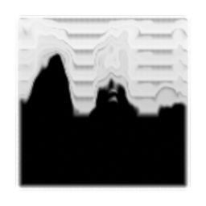
    
**Small step, high resolution:**
    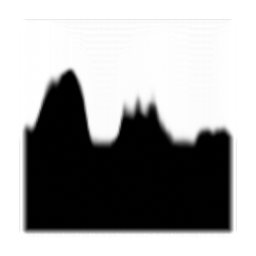

## Fade
The fade value can be positive or negative.

- Positive values allow for darker areas to flow into lighter areas.
- Negative values fade the attribute each iteration.

**No Fade:**
    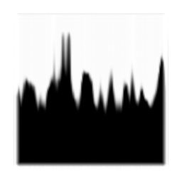
    
**Positive Fade:**
    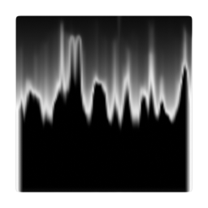
    
**Negative Fade:**
    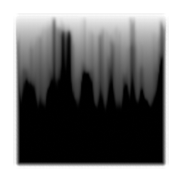

## Streaks

Streaks are created by a random noise slowing down the flow, by adjusting this noise you can achieve a wide variety of streak styles

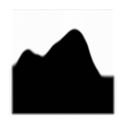

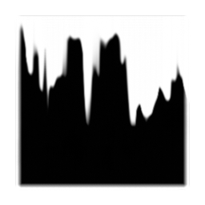

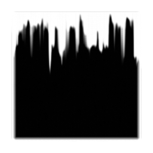

## Flow Direction
The direction of flow can be based on a single direction or vector attribute. Random direction can then be mixed in. For completely random direction set direction to [0,0,0] and random value to 1.

**Standard down direction:**
    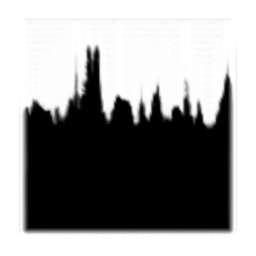

**Bidirectional on:**
    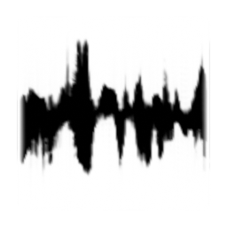

**Fully random bidirectional:**
    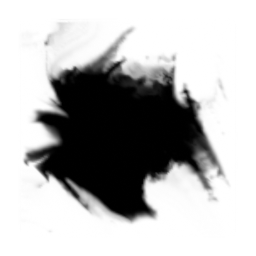

You can use directions output by [Curvature Direction](../create_attributes/curvature_direction.md). Bidirectional should be turned on because the curvature direction is bidirectional by default.

**Base noise:**
    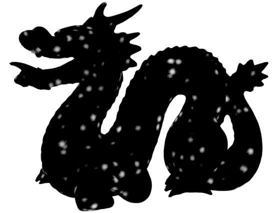

**Flow along max curvature:**
    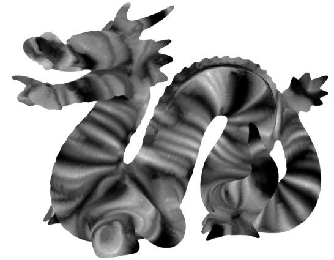

**Flow along min curvature:**
    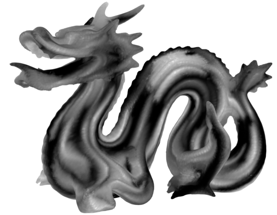

## Outputs
- **Attribute:** Output attribute with flow applied.
- **Color:** Output flowed attribute as color (used for visualisation).
## Settings

- **Attribute:** Attribute to run flow simulation on.
- **Simulation:** Calculate flow all at once or per frame:
    - **Static:** Calculate all flow steps at once, independent of time.
    - **Animated:** Calculate one step of flow per frame.

----
#### Direction
Direction of flow.

- **Space:** Coordinate space of flow direction:
    - **Local:** Flow direction is in local space (uses object rotation)
    - **Global:** Flow direction is in global space (ignores object rotation)
- **Direction:** Flow direction vector.
- **Random:** Mix in random noise to flow direction. A value of 1 will completely ignore specified direction.

----
#### Random Noise
Noise settings for the random direction.

- **Noise Scale:** Size of the largest features in the noise.
- **Octaves:** The number of noise octaves. Higher values give more detailed noise but increase render time.
- **Roughness:** Blend factor between an octave and its previous one. A value of zero corresponds to zero detail.
- **Noise Offset:** Offset the noise W position. Effectively a smooth transition between seeds.

----
#### Flow Steps
Flow simulation settings.

- **Flow Iterations:** How many iterations of flow to calculate.
- **Step Size:** Maximum distance travelled by each flow step. Bigger step sizes are cheaper to calculate but can result in stepping artifacts.
- **Fade:** Fade the head/tail of the flow simulation. Positive values will fade the tail (allowing darker areas to flow over lighter areas). Negative values fade the head resulting in a smooth fade out of the flow.
- **Minimum Angle Speed:** Decrease flow speed depending on surface angle. 0 will completely stop flow on surfaces perpendicular to the flow direction. 1 will ignore the surface angle and full flow speed will occur everywhere.

----
#### Streaks
Add streaks/noise to the flow simulation.

- **Amount:** Intensity of streaks applied to flow simulation.
- **Thickness:** Scale of the noise used for streaks. Higher value = thicker streaks.
- **Offset:** Offset the streak noise W position. Effectively a smooth transition between seeds.

----
#### Noise Values
Aditional noise settings to change the shape of streaks.

- **Noise Octaves:** The number of noise octaves. Higher values give more detailed noise but are more expensive. Stop increasing when there is no visual impact.
- **Noise Roughness:** Blend factor between an octave and its previous one. A value of zero corresponds to zero detail.
- **Stretch:** Stretch the noise used for streaks in the flow direction. 0 = No stretch, uniform noise. 1 = Maximum stretch, 2D noise.
- **Contrast:** Increase value contrast of noise, giving higher contrast streaks.
- **Bias:** Midpoint of contrast operation. Higher values will produce a darker noise.

----
#### Mask
Mask flow with an attribute.

- **Attribute:** Attribute to inhibit flow.

