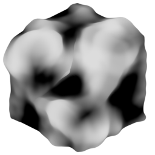

# Displace by Attribute

{ width=128 }

## Settings

- **Attribute:** Attribute to displace.
- **Direction:** Direction to displace verts:
    - **Normal:** Used point normals, respects custom normals
    - **Blurred Normal:** Used blurred point normals, respects custom normals
    - **True Normal:** Use intrinsic point normals, ignores custom normals
    - **Direction:** Specify a direction, can be a field
- **Direction:** Custom direction in object space to displace verts.
- **Blur Iterations:** Blur iterations for normal direction.
- **Amount:** Maximum amount to displace (where attribute is 1).

