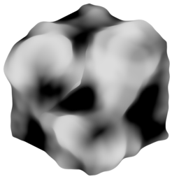
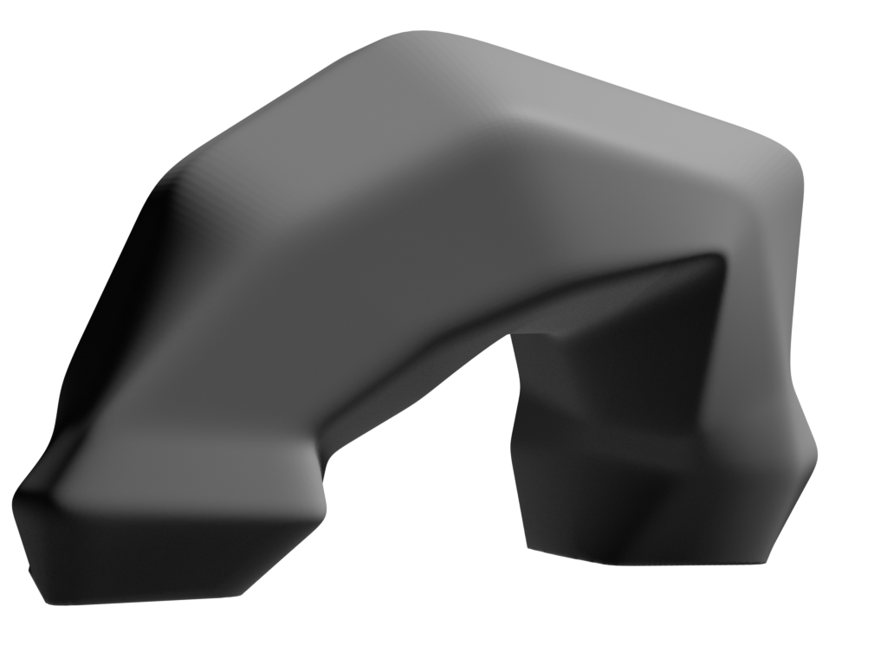
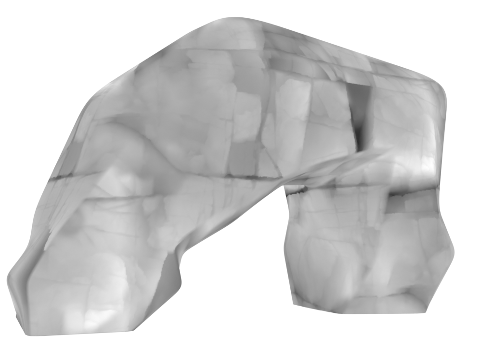
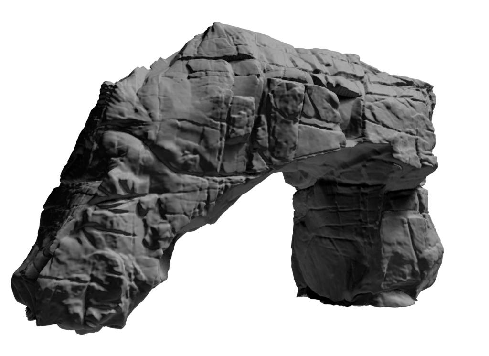
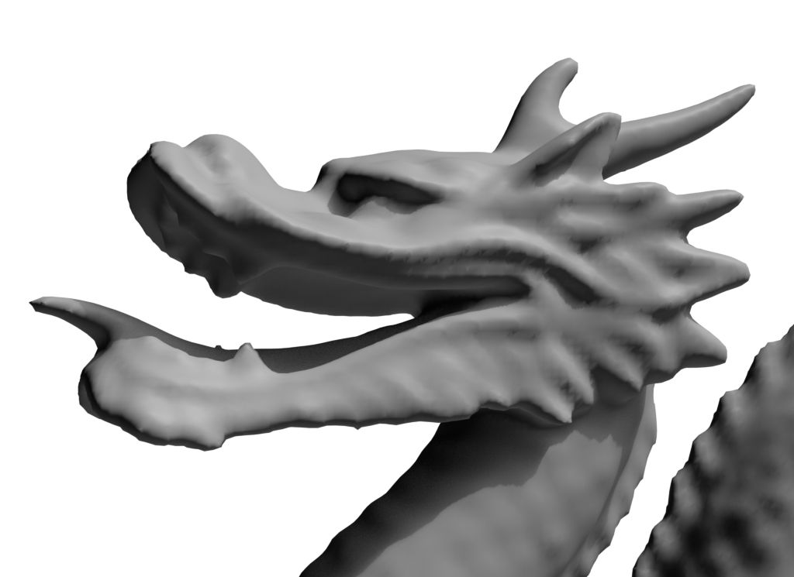
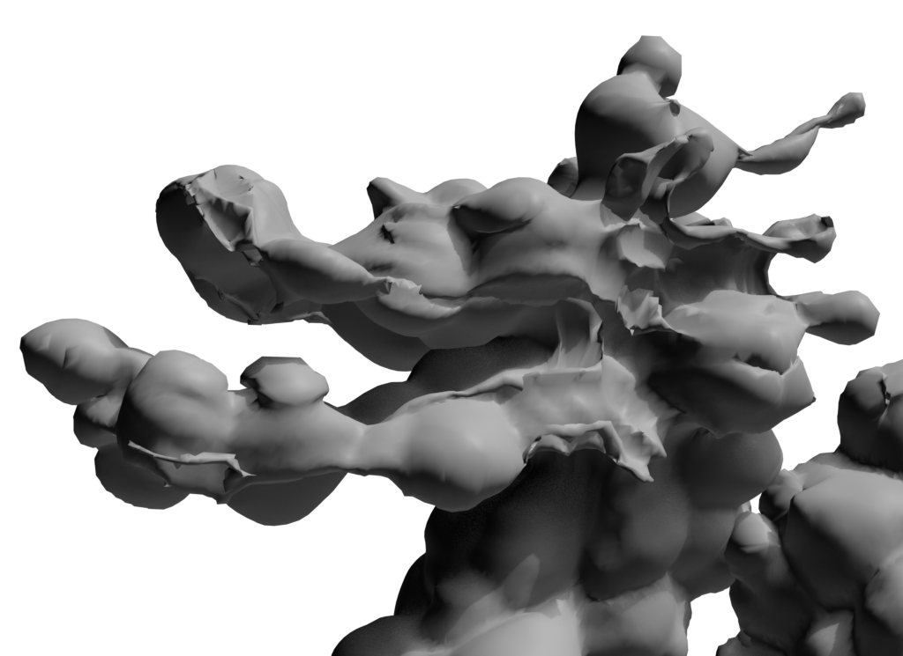
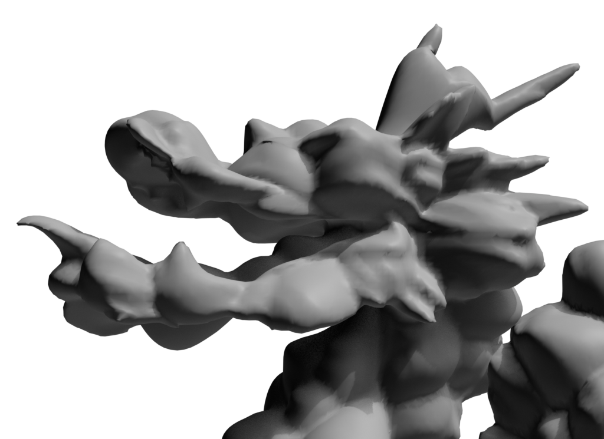

# Displace by Attribute

{ width=128 }

Displace vertices by an attribute. Similar to Blender's [Displace](https://docs.blender.org/manual/en/latest/modeling/modifiers/deform/displace.html) modifier but uses an attribute instead of a texture.

!!! tip "Combine with Tri-Planar Textures"
    
    

    

    

    

    

## Normal Smoothing

Displacing along normals can lead to intersecting artifacts in detailed areas. There is an option to displace along a smoothed normal that can reduce this.

**Base mesh:**

**Displace normal:**

**Displace smooth normal:**

## Settings

- **Attribute:** Attribute to displace.
- **Direction:** Direction to displace verts:
    - **Normal:** Used point normals, respects custom normals
    - **Blurred Normal:** Used blurred point normals, respects custom normals
    - **True Normal:** Use intrinsic point normals, ignores custom normals
    - **Direction:** Specify a direction, can be a field
- **Direction:** Custom direction in object space to displace verts.
- **Blur Iterations:** Blur iterations for normal direction.
- **Amount:** Maximum amount to displace (where attribute is 1).

