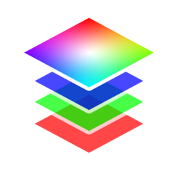

# Pack Color Attribute

{ width=128 }

## Outputs
- **Color (Point):** No description provided.
- **Color (Face Corner):** No description provided.
## Settings

- **Base Color:** Color attribute to blend on top of (optional).

----
#### Red/Green/Blue/Alpha
Pack/blend an attribute into the the specified channel.

- **Blend Mode:**
    - **Disable:** Disable blend
    - **Replace:** Replace A with B
    - **Multiply:** Muliply A by B
    - **Add:** Add B to A
    - **Min:** Minimum value of A and B
    - **Max:** Maximum value of A and B
    - **Screen:** Brighten A using the brightness of B
    - **Overlay:** Brighten/darken A using values above/below 0.5 on B. 
    - **Divide:** Divide A by B
    - **Subtract:** Subract B from A. 
- **Attribute:** Attribute to pack/blend into channel.
- **Opacity:** Opacity of blend. Supply attribute for local masking.
