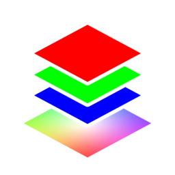

# Unpack Color Attribute

{ width=128 }

## Outputs
- **Red:** Red channel of color attribute.
- **Green:** Green channel of color attribute.
- **Blue:** Blue channel of color attribute.
- **Alpha:** Alpha channel of color attribute.
- **Color (Point):** Output color point attribute. This will be greyscale/single channel if "Write to Color" is used.
- **Color (Face Corner):** Output color face corner attribute. This will be greyscale/single channel if "Write to Color" is used.
## Settings

- **Color Attribute:** Color attribute to unpack.
- **Write to Color:** Write channel to output color attribute to visualize in viewport:
    - **X:** Don't overwrite color attribute
    - **R.**
    - **G.**
    - **B.**
    - **A.**

