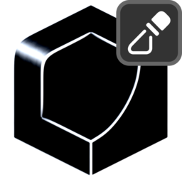

# Mask by Curvature

{ width=128 }

## Settings
#### Mix
Mix generated mask with existing one.

- **Blend Mode:** Blend mode with existing mask:
    - **Disable:** Disable blend
    - **Replace:** Replace A with B
    - **Multiply:** Muliply A by B
    - **Add:** Add B to A
    - **Min:** Minimum value of A and B
    - **Max:** Maximum value of A and B
    - **Screen:** Brighten A using the brightness of B
    - **Overlay:** Brighten/darken A using values above/below 0.5 on B. 
    - **Divide:** Divide A by B
    - **Subtract:** Subract B from A. 
- **Opacity:** Opacity of blend.

----
#### Curvature
Settings for curvature generation.

- **Curvature:** What areas of curvature to mask:
    - **Convex:** Mask convex areas, concave areas will be black
    - **Concave:** Mask concave areas, convex areas will be black
    - **Absolute:** Output both convex and concave curvature as lighter values
- **Method:** Method for measuring mesh curvature:
    - **Local Curvature:** Intrinsic curvature of the mesh. Fine details will effect the output dramatically
    - **Raycast Curvature:** Use raycast collisions to approximate larger scale curvature.
    - **SDF Curvature:** Generate a SDF from the mesh to read curvature from.
- **Strength:** Strength/contrast of the raycast result.
- **Calculate on Boundaries:** Cast rays from mesh boundaries. When on boundaries will often show convex curvature.
- **Ray Count:** Number of rays cast from each point. More rays increases quality but is more expensive. You can use a blur to smooth noise instead of raising the number of rays too high.
- **Ray Length:** Maximum distance to check for ray collisions. This will likely increase collisions and therefore scew the curvature towards concave (darker).
- **Voxel Size:** Voxel size of the SDF, smaller values will create more detailed results but get exponentially more expensive. Hold [Shift] for more granular control.
- **Smooth SDF:** Number of iterations to smooth the SDF before reading curvature.

----
#### Blur
Blur curvature to smooth results, useful for reducing raycast noise.

- **Blur Iterations:** Blur iterations to apply to curvature.

----
#### Values
Further adjust mask values.

- **Invert:** Invert output mask.
- **Black Point:** Black point of mask, increase to spread black values.
- **White Point:** White point of mask, decrease to spread white values.

