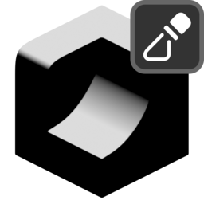

# Mask by Direction

{ width=128 }

## Settings

- **Space:** Coordinate space of direction vector:
    - **Local.**
    - **Global.**
- **Direction:** Direction to measure angle against.
- **Both Directions:** Also measure the reverse direction and choose the maximum value.
- **Angle Type:** How the angle to the direction is measured:
    - **Threshold:** Simple binary cutoff based on an angle threshold.
    - **Range:** Fade values between a minimum and maximum angle value
- **Threshold:** Angle threshold for normals. Normals that are within this range of the direction will be white, others will be black.
- **Min Angle:** Normals within this angle of the direction will be white.
- **Max Angle:** Normals between the min and max angle will interpolate smoothly transition from white to black.
- **Invert Value:** Invert the mask.

----
#### Mix
Mix generated mask with existing one.

- **Blend Mode:** Blend mode with existing mask:
    - **Disable:** Disable blend
    - **Replace:** Replace A with B
    - **Multiply:** Muliply A by B
    - **Add:** Add B to A
    - **Min:** Minimum value of A and B
    - **Max:** Maximum value of A and B
    - **Screen:** Brighten A using the brightness of B
    - **Overlay:** Brighten/darken A using values above/below 0.5 on B. 
    - **Divide:** Divide A by B
    - **Subtract:** Subract B from A. 
- **Opacity:** Opacity of blend.

