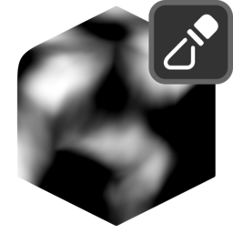

# Mask by Noise

{ width=128 }

## Settings

#### Mix
Mix generated mask with existing one.

- **Blend Mode:** Blend mode with existing mask:
    - **Disable:** Disable blend.
    - **Replace:** Replace A with B.
    - **Multiply:** Muliply A by B.
    - **Add:** Add B to A.
    - **Min:** Minimum value of A and B.
    - **Max:** Maximum value of A and B.
    - **Screen:** Brighten A using the brightness of B.
    - **Overlay:** Brighten/darken A using values above/below 0.5 on B.
    - **Divide:** Divide A by B.
    - **Subtract:** Subract B from A.
- **Opacity:** Opacity of blend.

----
#### Noise Settings
- **Space:** Coordinate space used for noise:
    - **Local:** Use object's space.
    - **Global:** Use global space.
- **Noise Type:** Type of noise to generate:
    - **fBM.**
    - **Voronoi Distance.**
    - **Voronoi Cells.**
- **Voronoi Type:** Voronoi feature to compute:
    - **F1:** Distance to closest point.
    - **F2:** Distance to second closest point.
    - **Edge Distance:** Distance to edge of voronoi cell.
- **Distance:** Distance metric:
    - **Euclidian:** Euclidian distance (actual 3d distance).
    - **Manhattan:** Manhattan distance, separates distance components and adds them together.
    - **Chebychev:** Chebychev distance, separates distance components and chooses largest.
    - **Minkowski:** Minowski distance.
- **Feature Size:** Size of the largest features in the noise.
- **Offset:** Offset the noise W position. Effectively a smooth transition between seeds.
- **Detail:** The number of noise octaves. Higher values give more detailed noise but increase render time.
- **Detail:** The number of Voronoi layers to sum.
- **Roughness:** Blend factor between an octave and its previous one. A value of zero corresponds to zero detail.
- **Lacunarity:** The difference between the scale of each two consecutive octaves. Larger values corresponds to larger scale for higher octaves.
- **Exponent:** Exponent of the Minkowski distance.
- **Randomness:** Randomness of Voronoi points.

----
#### Distortion
Apply distortion to the noise.

- **Scale:** Scale applied to noise coordinates. Useful for directional noise such as wood grain or rock strata.
- **Warp:** Use another noise to warp coordinates.
- **Warp Amount:** Amount to warp the noise.
- **Feature Size:** Size of the largest features in the distortion noise.
- **Detail:** The number of noise octaves. Higher values give more detailed noise but increase render time.
- **Scale Effect:** How much non-uniform scale is applied to the warp noise.

----
#### Values
Remap the values of the noise.

- **Splits:** Create a saw-tooth banding effect. This value corresponds to the number of bands applied.
- **Fold:** Invert values above/below a threshold. Another method of creating a banding effect. Can be used to remove the abrupt changes in values caused by splits:
    - **None.**
    - **Peaks:** Invert values above a threshold.
    - **Valleys:** Invert values below a threshold.
- **Threshold.**
- **Levels:** Remap values:
    - **None.**
    - **Auto:** Detect the minimum and maximum values on geometry and remap to use the full 0-1 range. Optionally change the gamma.
    - **Manual:** Specify the min/max input, interpolation and gamma.
- **Interpolation:** Interpolation used for levels.
    - **Linear.**
    - **Smooth.**
- **Clamp:** Clamp output values between 0-1.
- **Min:** Minimum input value. Increase to spread black values.
- **Max:** Maximum input value. Decrease to spread white values.
- **Gamma:** Gamma of midtone values.

