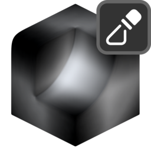

# Mask by Thickness

{ width=128 }

## Settings

#### Mix
Mix generated mask with existing one.

- **Blend Mode:** Blend mode with existing mask:
    - **Disable:** Disable blend.
    - **Replace:** Replace A with B.
    - **Multiply:** Muliply A by B.
    - **Add:** Add B to A.
    - **Min:** Minimum value of A and B.
    - **Max:** Maximum value of A and B.
    - **Screen:** Brighten A using the brightness of B.
    - **Overlay:** Brighten/darken A using values above/below 0.5 on B.
    - **Divide:** Divide A by B.
    - **Subtract:** Subract B from A.
- **Opacity:** Opacity of blend.

----
#### Rays
- **Accumilation:** How ray values are accumilated:
    - **Average Hit Distance:** Uses the average ray hit distance compared with the ray length. Often produces smoother results but values will change with the ray length.
    - **Hit Count:** Uses ray hit/miss ratio. Can be noisier but values are independent of ray length.
- **Ray Count:** Number of rays cast from each point.
- **Ray Length:** Maximum distance to check for ray collisions.
- **ConeAngle:** Maximum ray angle from the normal. Rays will be distributed evenly in a cone up to this angle.

----
#### Blur
Blur result. Improves noisy results.

- **Blur Iterations:** How many iterations to blur the result.

----
#### Values
Further adjust mask values.

- **Invert:** Invert output mask.
- **Black Point:** Black point of mask, increase to spread black values.
- **White Point:** White point of mask, decrease to spread white values.

