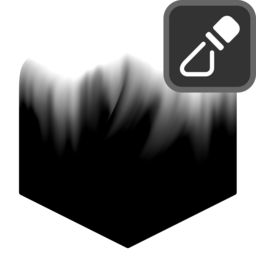

# Mask from Attribute

## Settings

{ width=128 }

- **Attribute:** Attribute to use as mask.

----
#### Mix
Mix generated mask with existing one.

- **Blend Mode:** Blend mode with existing mask:
    - **Disable:** Disable blend.
    - **Replace:** Replace A with B.
    - **Multiply:** Muliply A by B.
    - **Add:** Add B to A.
    - **Min:** Minimum value of A and B.
    - **Max:** Maximum value of A and B.
    - **Screen:** Brighten A using the brightness of B.
    - **Overlay:** Brighten/darken A using values above/below 0.5 on B.
    - **Divide:** Divide A by B.
    - **Subtract:** Subract B from A.
- **Opacity:** Opacity of blend.

