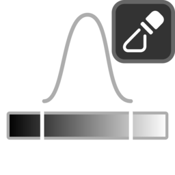

# Mask Remap

{ width=128 }

## Settings

#### Blur
Blur attribute before remapping.

- **Iterations:** How many times to blur the values for all elements.

----
#### Levels
Remap attribute with levels.

- **Interpolation:** Interpolation used for levels:
    - **Linear.**
    - **Smooth.**
    - **Stepped.**
- **Input Range:** Min/max input values. Use to increase contrast and spread black/white values.
- **Output Range:** Define the value range of the output.
- **Steps:** Number of steps/bands.
- **Clamp:** Clamps output range between 0-1.
- **Gamma:** Apply gamma to output values. 1 = no change, higher values darken, lower values brighten.

----
#### Histogram
Perform histogram operations.

- **Splits:** Create a saw-tooth banding effect. This value corresponds to the number of bands applied.
- **Offset:** Offset the histogram. (Add this value then ignore the integer component of the result).
- **Fold:** Invert values above/below a threshold. Another method of creating a banding effect. Can be used to remove the abrupt changes in values caused by splits:
    - **None.**
    - **Peaks:** Invert values above a threshold.
    - **Valleys:** Invert values below a threshold.
- **Fold Interpolation:** Perform an additional interpolation of values after fold. This can be used to smooth sharp creases where the fold occurs:
    - **Linear.**
    - **Smooth.**
    - **Smoother.**
- **Fold Threshold:** Threshold of fold operation.

