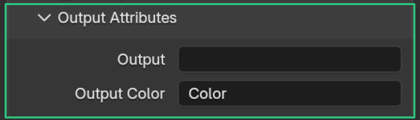
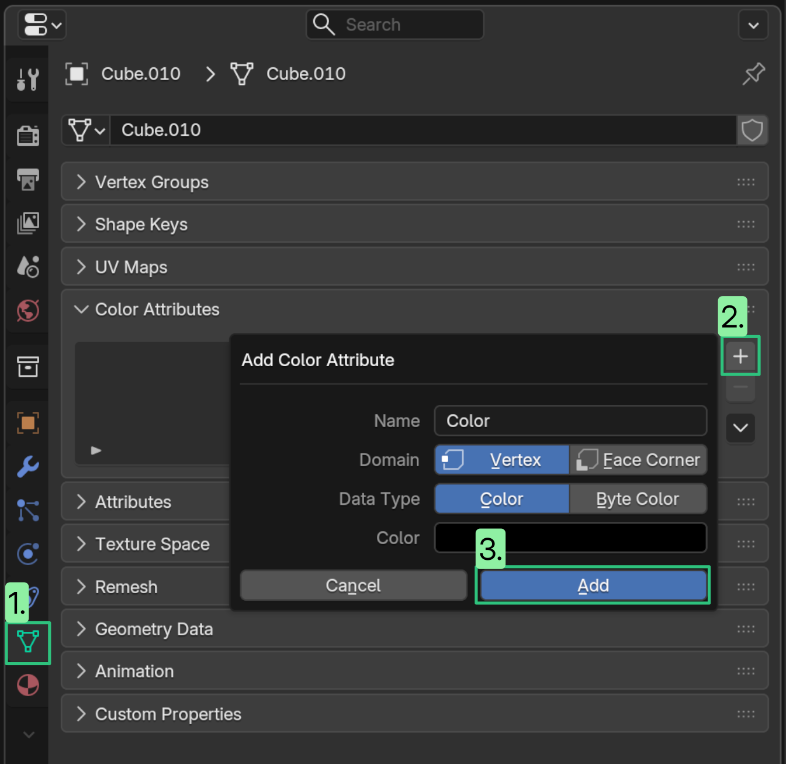
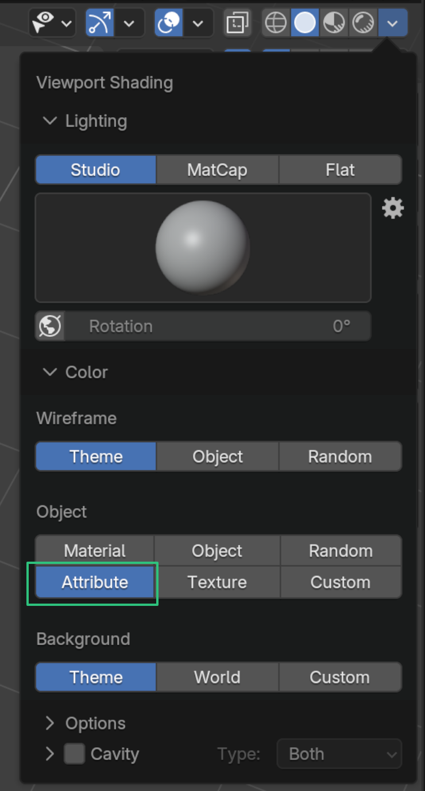

# Working with Attributes

## Output Attributes

!!! tip "Output Attributes"
    **Output Attributes** is the most important section of vertLab modifiers. This tells the modifier which attributes to write to.

    { width=512 }
    
    By default most modifiers will write to the *Color* attribute for easy visualisation in the viewport.

You can write to existing attributes or create new ones by typing a new name.

## Viewing attributes in the viewport

By default vertLab modifiers overwrite the *Color* attribute so their effect can be easily seen in the viewport.\* To show *Color* in the viewport:

- __1. Add Color Attribute__

    ---

    Add a *Color* attribute to your mesh if it hasn't got one.

    

    (This is because Blender looks for the "active color attribute" to know which one to visualize).

- __2. Change Viewport Shading__

    ---

    In the Viewport Shading menu set object color to "Attribute".

    

## Keeping track of attributes
You can see all the attributes a mesh has by looking at the     geometry spreadsheet.  

### Points vs Face Corners
vertLab attributes can be stored as either point or face corner attributes.
